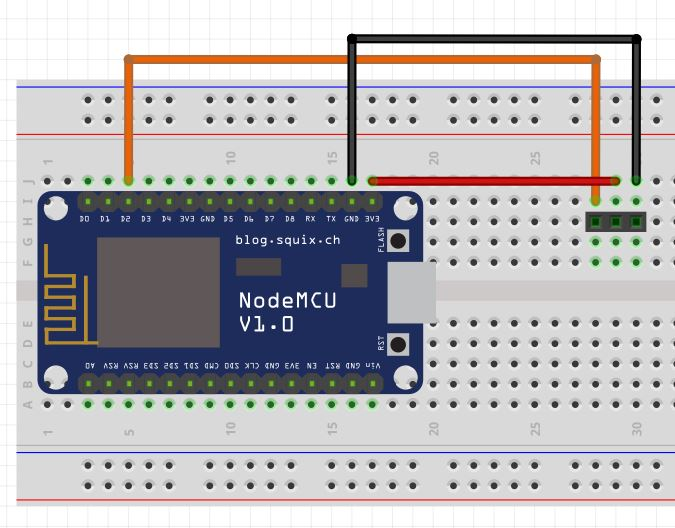
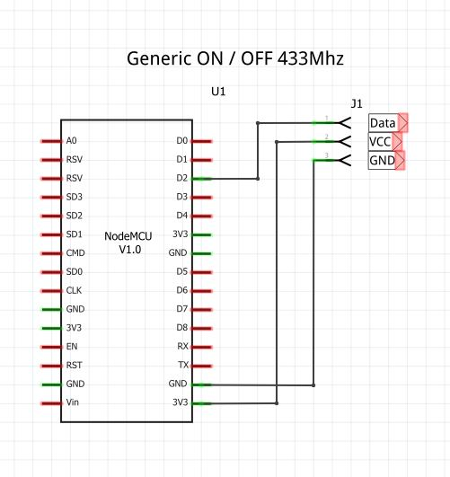
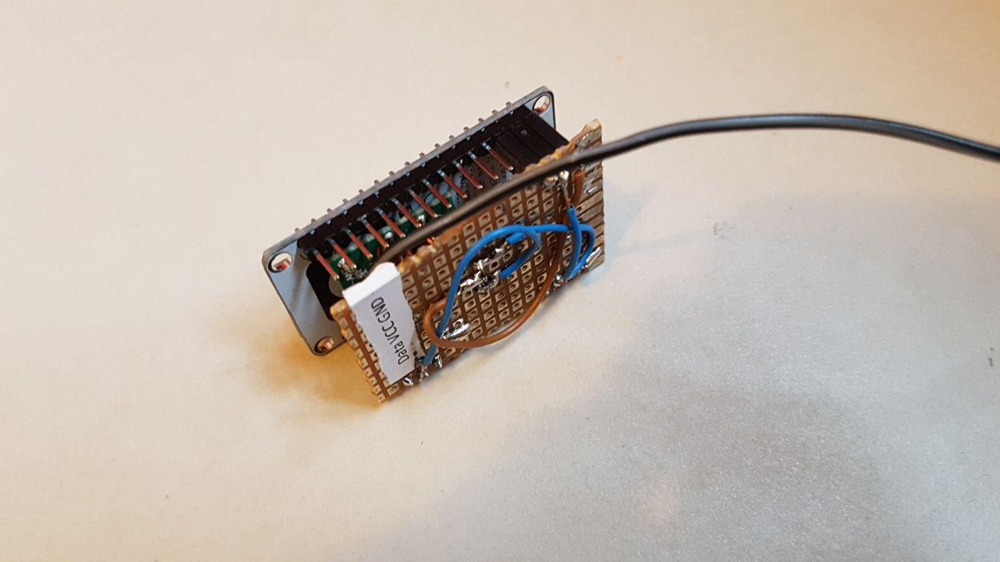
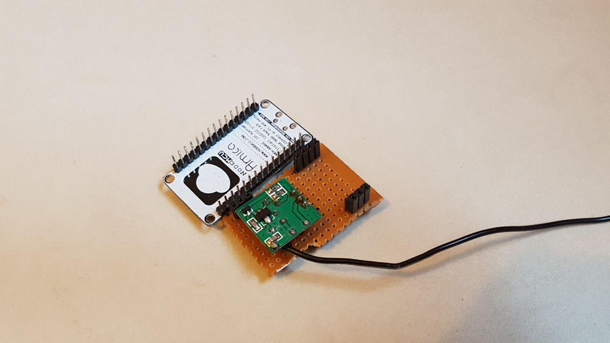

# 433Mhz Power Socket - Control (Hue Bulb Emulation)
This ESP-8266 Firmware controls generic 433Mhz Power Sockets.
Showing up as regular Hue Bulbs with ON/OFF feature.

* I used one of those cheap Transmitters. [Ebay-Link](https://www.ebay.com/itm/5pcs-433Mhz-RF-transmitter-and-receiver-kit-for-Arduino/381374427148?epid=2037463354&hash=item58cbaff00c:g:8wEAAOSw6EhUN9s-)
* Controlling cheap 433mhz Power Sockets [Picture below]

* Directly connected to VCC(+3,3V) GPIO4 (Data) and GND.
* You need to Edit your **"House Code"** in order to control the correct Sockets!

 
  
  

 
 

  </img>

 
 

  </img>

 
 

  </img>

 
 

  </img>

